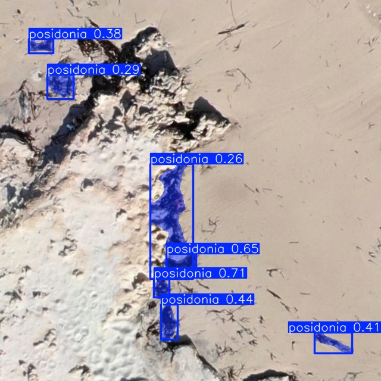
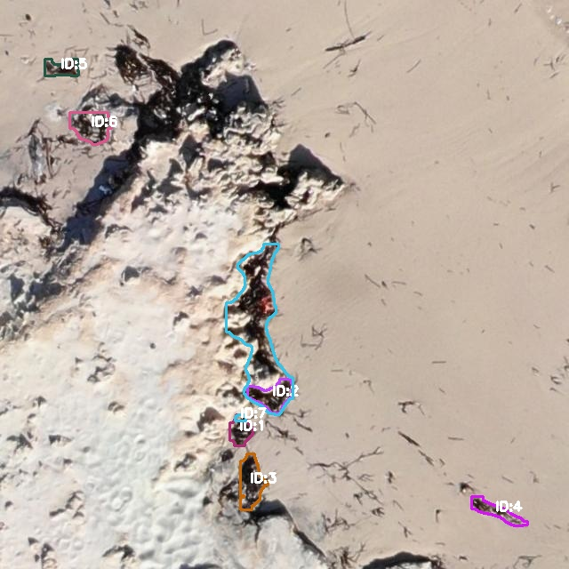
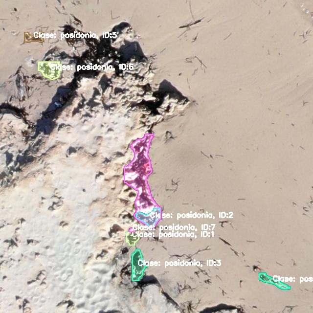
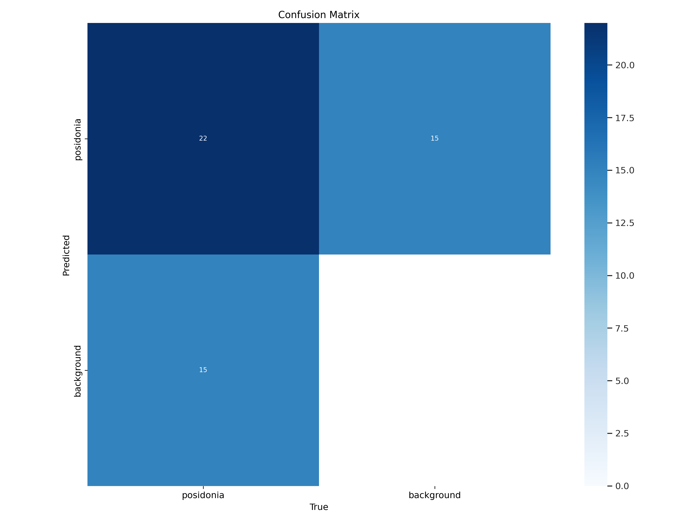
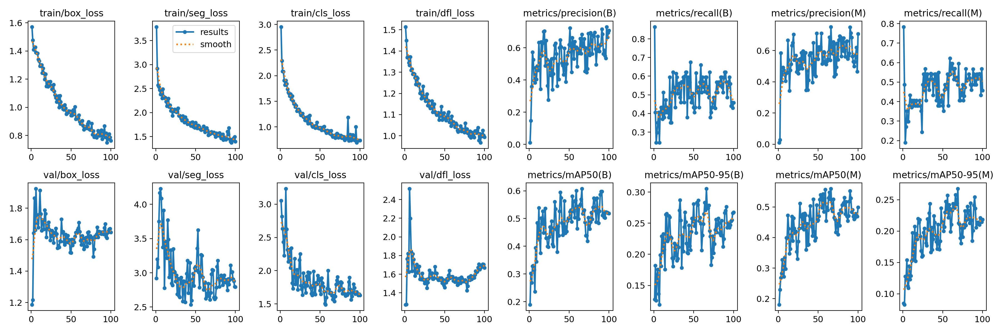

# Posidonia Segmentation YOLOV8

Training and validation with yolov8 with the [posidonia roboflow](https://universe.roboflow.com/posidonie/pos-2/dataset/6) dataset (segmented labeling) where instance counting and instance segmentation are done

-----

#### Validation Results

  

#### Validation Results with Instances

  

#### Validation Results with Instances Masks

  

#### Confusion Matrix

  

#### Results

  

